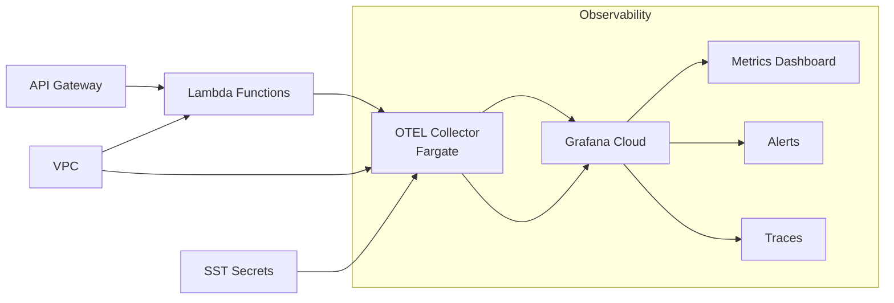

# Kept

## Purpose

Kept is a lightweight, API-first knowledge graph service with integrated observability.

## Architecture



## Project Structure

```
/
├── lambda/                   # Lambda functions and handlers
├── collector/                # OTEL collector configuration and Dockerfile  
├── infrastructure/           # SST infrastructure modules (API, services, secrets)
├── sst.config.ts            # SST deployment configuration
└── Makefile                 # Build and deployment targets
```

## Requirements

- Go 1.24+
- Node.js (for SST deployment via npx)

## Contracts
### Application

 - Lambda function exposes GET /healthz via API Gateway.

 - Returns status 200 and body "Healthy".

 - Integrated with OpenTelemetry for metrics collection.

### Tests

 - Tests are executed via gotestsum.

 - make test must pass without network access.

 - At least one test asserts that /healthz returns 200 OK.

### Makefile

 - make setup installs required local tooling.

 - make build builds all Go packages.

 - make test runs the test suite with coverage.

 - make tidy updates Go module dependencies.

 - make fmt formats Go code.

 - make deploy-staging deploys to staging environment.
 
 - make deploy-prod deploys to production environment.

### CI

 - Triggered on push and pull_request.

 - Runs with Go 1.24.x.

 - Executes make test.

 - Passes only if all tests succeed.

### CD

 - Triggered on push to main.

 - Authenticates to AWS via GitHub OIDC.

 - Deploys to region eu-west-2 using SST.

 - Workflow logs emit the API URL.

 - Calling GET {ApiUrl}/healthz via deployed Lambda must return 200 ok.

### SST stack

 - App name: kept.

 - Region: eu-west-2.

 - One HTTP API resource routes GET /healthz to the Go Lambda handler.

 - Infrastructure defined in modular TypeScript files.

 - CloudFormation outputs include KeptAPI URL.

### Observability

 - OpenTelemetry metrics collection integrated into Lambda functions.

 - OTEL collector deployed on Fargate with direct VPC service discovery.

 - End-to-end metrics pipeline: Lambda → Collector → Grafana Cloud.

 - SST secret management for secure API key handling.

### Configuration

 - No secrets stored in repo.

 - CI requires no secrets.

 - CD requires an AWS role ARN supplied via repo/org secrets.

## Verification

From a fresh clone:

1. make setup
2. make build → builds all packages.
3. make test → green with 100% coverage.
4. make deploy-staging → deploys and tests staging environment.